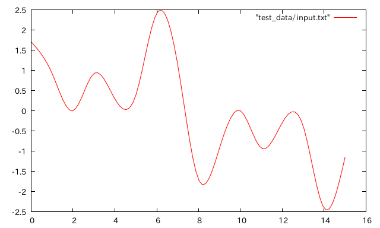
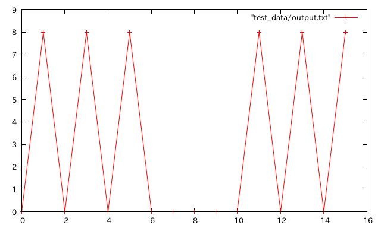

Fourier Transform 1D
===

Parallel.OpenCLを使っての離散1次元フーリエ変換プログラム。
.cabalファイルの練習とかmoduleを切る練習とかとか。

このような振幅を持った波形の波を



フーリエ変換すると



となります。この変換の1次元実装です。

入力データの波は3つの周波数を持つ波の合成であることが分かります。

## Try it

If you install cabal packages, __strongly recommended__ use cabal-dev.

And double floating point type supported OpenCL Device is required.

```bash
$ cabal-dev configure
$ cabal-dev install --only-dependencies
$ cabal-dev build
$ ./dist/build/ft_1d/ft_1d [input data file]
```

## example result
```bash
$ ./dist/build/ft_1d/ft_1d "test_data/input.txt"
```

outputs

```
[0x0000000001db0620]
[CL_DEVICE_TYPE_GPU]
Original array =
1.7071067812
0.9238795325
-0.0
0.9238795325
0.2928932188
0.3826834324
2.4142135624
1.1480502971
-1.7071067812
-0.9238795325
0.0
-0.9238795325
-0.2928932188
-0.3826834324
-2.4142135624
-1.1480502971

Result array   =
6.661338147750939e-16
8.000000000049777
7.938115703915682e-16
8.000000000122203
4.4260817179820244e-15
7.999999999991849
7.015391459123505e-15
6.042233352521482e-11
4.991636170995617e-15
6.041867178417157e-11
6.27586489761324e-15
7.9999999999918465
2.4970138487129154e-14
8.000000000122185
2.1255490196279483e-14
8.000000000049791
```